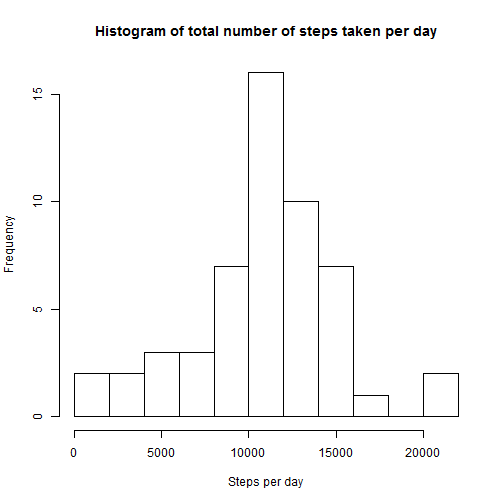
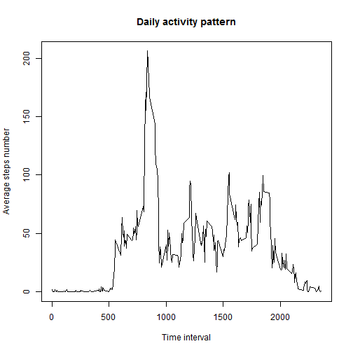
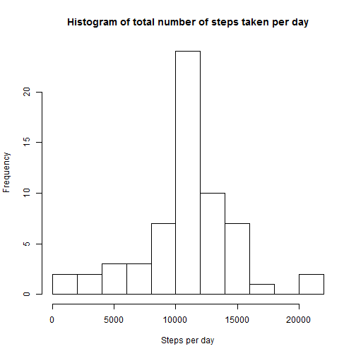
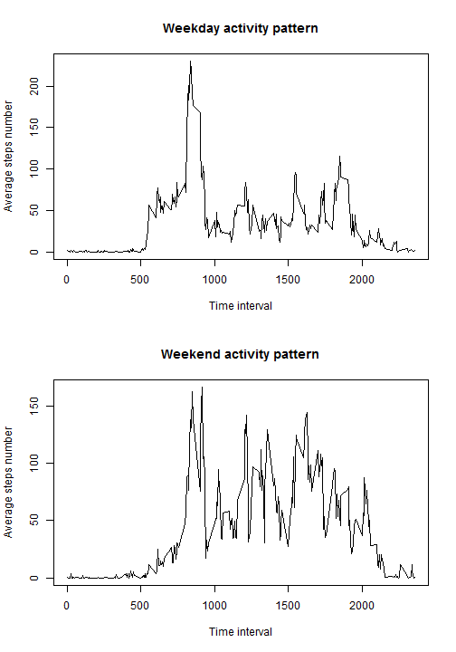

## Loading and preprocessing the data
First of all, we should read the data from zip archive and make sure it is correct. 

```r
df <- read.csv(unz("activity.zip", "activity.csv"))
head(df)
```

```
##   steps       date interval
## 1    NA 2012-10-01        0
## 2    NA 2012-10-01        5
## 3    NA 2012-10-01       10
## 4    NA 2012-10-01       15
## 5    NA 2012-10-01       20
## 6    NA 2012-10-01       25
```


## What is mean total number of steps taken per day?
We should split our dataset by date and then apply sum to it to get the total number of steps. Then we plot a histogram of this data.

```r
steps_per_day <- tapply(df$steps, df$date, sum)
hist(steps_per_day, breaks = 9, main = "Histogram of total number of steps taken per day", xlab = "Steps per day")
```

 

Mean and median of total number of steps per day:

```r
mean(steps_per_day, na.rm = TRUE)
```

```
## [1] 10766.19
```

```r
median(steps_per_day, na.rm = TRUE)
```

```
## [1] 10765
```


## What is the average daily activity pattern?
Next we will make a time series plot of the 5-minute interval (x-axis) and the average number of steps taken, averaged across all days (y-axis)

```r
activity_pattern <- tapply(df$steps, df$interval, mean, na.rm = TRUE)
plot(names(activity_pattern), activity_pattern, type = "l", main = "Daily activity pattern", xlab = "Time interval", ylab = "Average steps number" )
```

 

Interval with maximum number of steps:

```r
names(activity_pattern)[which.max(activity_pattern)]
```

```
## [1] "835"
```


## Imputing missing values
Number of missing variables

```r
missing <-!complete.cases(df) 
sum(missing)
```

```
## [1] 2304
```
We will use mean for this 5-minute interval for filling, i.e. our activity_pattern variable. We create a copy of "df" dataframe named "dfc" and replace all missing values with averages from "activity_pattern" Then we will plot the histogram and find mean and median like we did for "df" dataframe.

```r
dfc <- df
dfc$steps[missing] <- activity_pattern[format(dfc$interval[missing], trim = TRUE)]

steps_per_day_c <- tapply(dfc$steps, dfc$date, sum)
hist(steps_per_day_c, breaks = 9, main = "Histogram of total number of steps taken per day", xlab = "Steps per day")
```

 

```r
mean(steps_per_day_c)
```

```
## [1] 10766.19
```

```r
median(steps_per_day_c)
```

```
## [1] 10766.19
```

As we can see, difference between this and what we get in the first part is small. Histogram looks just the same, mean didn't changed, median changed a little. However, now median equals to mean.


## Are there differences in activity patterns between weekdays and weekends?
Here we get day of the week from date, then merge factors to Weekday/Weekend. Sys.setlocale() is needed for english names of days of the week.

```r
Sys.setlocale("LC_TIME", "English")
```

```
## [1] "English_United States.1252"
```

```r
dfc$day <- as.factor(weekdays(as.Date(dfc$date)))
levels(dfc$day)
```

```
## [1] "Friday"    "Monday"    "Saturday"  "Sunday"    "Thursday"  "Tuesday"  
## [7] "Wednesday"
```

```r
levels(dfc$day) <- c("Weekday", "Weekday", "Weekend", "Weekend", "Weekday", "Weekday", "Weekday")
dfcs <- split(dfc, dfc$day)
weekday_pattern <- tapply(dfcs$Weekday$steps, dfcs$Weekday$interval, mean, na.rm = TRUE)
weekend_pattern <- tapply(dfcs$Weekend$steps, dfcs$Weekend$interval, mean, na.rm = TRUE)
par(mfrow = c(2, 1))
plot(names(weekday_pattern), weekday_pattern, type = "l", main = "Weekday activity pattern", xlab = "Time interval", ylab = "Average steps number" )
plot(names(weekend_pattern), weekend_pattern, type = "l", main = "Weekend activity pattern", xlab = "Time interval", ylab = "Average steps number" )
```

 

